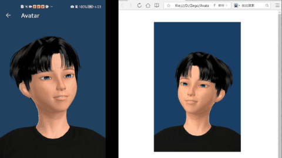
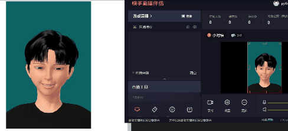
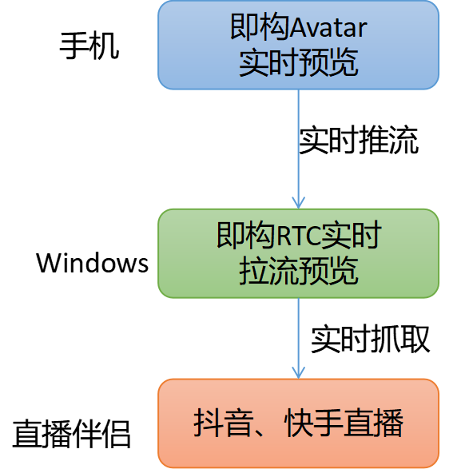
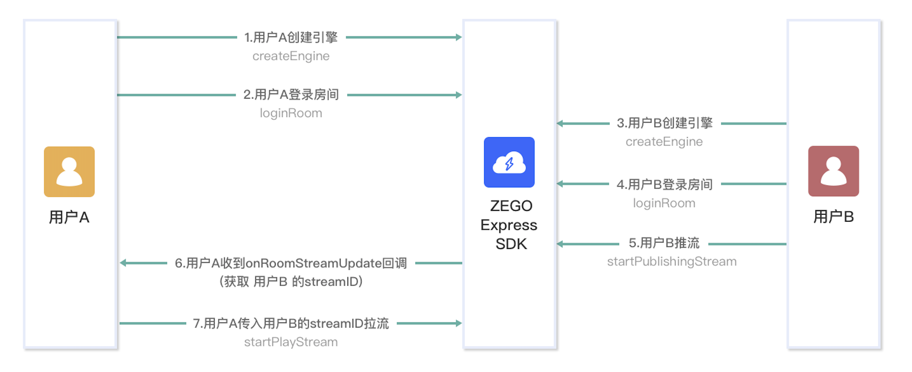
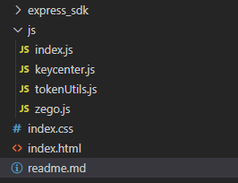

在上一篇文章[零基础开启元宇宙——创建虚拟形象](这里的网址需要@陈秀翠替换)中，我们实现了创建虚拟形象，接下来我们可以利用虚拟形象“为所欲为”。今天我们利用虚拟形象在短视频平台如快手、抖音中直播，对于不希望露脸的主播们这是可是一大利器呀！话不多说，上绝活。






# 1 实现思路
通过即构免费提供的虚拟形象和实时RTC技术，结合抖音快手官方提供的直播伴侣，可以轻松实现虚拟形象在抖音快手平台直播，整个实现流程如下：



# 2 Android接入RTC推送实时预览画面
## 2.1 接入RTC SDK
前往[https://doc-zh.zego.im/article/2969](https://doc-zh.zego.im/article/2969)下载即构RTC SDK。将压缩包内容拷贝到`app/libs`中，并修改`app/build.gradle`添加如下内容：
```gradle
// ...
// 其他略
// ...

android {
    // ...
    // 其他略
    // ...
    defaultConfig { 
            
        // ...
        // 其他略
        // ...

        ndk {
            abiFilters 'armeabi-v7a', 'arm64-v8a', 'x86', 'x86_64'
        }
    }
    sourceSets {
        main {
            jniLibs.srcDirs = ['libs']

        }
    } 
}

dependencies {
    implementation fileTree(dir: 'libs', include: ['*.jar', "*.aar"]) //通配引入

    // ...
    // 其他略
    // ...
}


```
在`app/src/main/AndroidManifest.xml`文件中添加必要的权限信息：
```xml

<uses-permission android:name="android.permission.RECORD_AUDIO" />
<uses-permission android:name="android.permission.INTERNET" />
<uses-permission android:name="android.permission.ACCESS_WIFI_STATE" />
<uses-permission android:name="android.permission.ACCESS_NETWORK_STATE" />
<uses-permission android:name="android.permission.CAMERA" />
<uses-permission android:name="android.permission.BLUETOOTH" />
<uses-permission android:name="android.permission.MODIFY_AUDIO_SETTINGS" />
<uses-permission android:name="android.permission.WRITE_EXTERNAL_STORAGE" />
<uses-permission android:name="android.permission.READ_EXTERNAL_STORAGE" />

<uses-feature
    android:glEsVersion="0x00020000"
    android:required="true" />
<uses-feature android:name="android.hardware.camera" />
<uses-feature android:name="android.hardware.camera.autofocus" />
```

## 2.1 虚拟形象实时推流
使用即构RTC SDK实现实时视频通话过程如下图：



根据我们目前的需求，只需实现在Android端推流，windows端拉流即可。因此我们接下来只介绍如何在android端推流，如果想实现更丰富的定制能力，参考官网[https://doc-zh.zego.im/article/195](https://doc-zh.zego.im/article/195)即可。

出于篇幅考虑，我们这里只展示关键代码：
```java
private ZegoExpressEngine createRTCEngine(Application app, IZegoEventHandler handler) { 
    ZegoEngineProfile profile = new ZegoEngineProfile();
    profile.appID = KeyCenter.APP_ID;
    profile.scenario = ZegoScenario.GENERAL;  // 通用场景接入
    profile.application = app;
    ZegoExpressEngine engine = ZegoExpressEngine.createEngine(profile, handler); 
    return engine;
}

public void start(String userId, String userName, String roomId, RTCListener listener) {
    Log.e(TAG, "准备登陆房间");
    loginRoom(userId, userName, roomId, listener);
}

public void stop() {
    loginOut();
}

public void setCustomVideo(int videoWidth, int videoHeight, RTCMngr.CaptureListener listener) {

    // 自定义视频采集
    ZegoCustomVideoCaptureConfig videoCaptureConfig = new ZegoCustomVideoCaptureConfig();
    // 选择 GL_TEXTURE_2D 类型视频帧数据
    videoCaptureConfig.bufferType = ZegoVideoBufferType.GL_TEXTURE_2D;
    // 启动自定义视频采集
    mRTCEngine.enableCustomVideoCapture(true, videoCaptureConfig, ZegoPublishChannel.MAIN);

    // 设置自定义视频采集回调
    mRTCEngine.setCustomVideoCaptureHandler(new IZegoCustomVideoCaptureHandler() {
        @Override
        public void onStart(ZegoPublishChannel zegoPublishChannel) {
            if (listener != null) {
                listener.onStartCapture();
            }
        }

        @Override
        public void onStop(ZegoPublishChannel zegoPublishChannel) {
            if (listener != null) {
                listener.onStopCapture();
            }

        }
    });

    // 设置视频配置, 要跟 avatar 的输出尺寸一致
    ZegoVideoConfig videoConfig = new ZegoVideoConfig(ZegoVideoConfigPreset.PRESET_720P);
    // 输出纹理是正方形的, 要配置一下
    videoConfig.setEncodeResolution(videoWidth, videoHeight);
    mRTCEngine.setVideoConfig(videoConfig);
}

//实时推流
public void pushStream(String streamId, TextureView tv) {
    mRTCEngine.startPublishingStream(streamId);
    mRTCEngine.startPreview(new ZegoCanvas(tv));

}

public boolean loginRoom(String userId, String userName, String roomId, RTCListener listener) {
    mRoomId = roomId;
    mUserId = userId;
    ZegoUser user = new ZegoUser(userId, userName);
    ZegoRoomConfig config = new ZegoRoomConfig();
    config.token = getToken(userId, roomId); // 请求开发者服务端获取
    config.isUserStatusNotify = true;
    mRTCEngine.loginRoom(roomId, user, config, (int error, JSONObject extendedData) -> {
        if (listener != null) {
            listener.onLogin(error);
        }
    });
    Log.e(TAG, "登录房间：" + roomId);
    return true;
}

public void loginOut() {
    mRTCEngine.stopPublishingStream();
    mRTCEngine.logoutRoom(mRoomId);
}

@Override
public void onRoomTokenWillExpire(String roomID) {
    mRTCEngine.renewToken(roomID, getToken(mUserId, roomID));
}

/**
* 此函数应该放在服务器端执行，以防止泄露ServerSecret
*/
public static String getToken(String userId, String roomId) {
    TokenEntity tokenEntity = new TokenEntity(KeyCenter.APP_ID, userId, roomId, 60 * 60, 1, 1);

    String token = TokenUtils.generateToken04(tokenEntity);
    return token;
}
```
首先执行顺序如下：
1. createRTCEngine, 获取RTC引擎对象：engine。
2. setCustomVideo, 用于设置自定义推流采样视频帧数据相关属性。
3. loginRoom，登录房间，登录房间函数会自动调用getToken获取token令牌做权鉴。

 

这里注意在setCustomVideo函数内执行了setCustomVideoCaptureHandler，这里我们将他间接转为了如下接口：
```java
public interface CaptureListener {
    void onStartCapture();
    void onStopCapture();
}
```
上面对象用于监听开始抓取推流数据和停止抓取事件，在Avatar侧只需实现上面两个接口即可：
```java
// 获取到 avatar 纹理后的处理
public void onCaptureAvatar(int textureId, int width, int height) {
    if (mIsStop || mUser == null) { // rtc 的 onStop 是异步的, 可能activity已经运行到onStop了, rtc还没
        return;
    }
    boolean useFBO = true;
    if (mBgRender == null) {
        mBgRender = new TextureBgRender(textureId, useFBO, width, height, Texture2dProgram.ProgramType.TEXTURE_2D_BG);
    }
    mBgRender.setInputTexture(textureId);
    float r = Color.red(mUser.bgColor) / 255f;
    float g = Color.green(mUser.bgColor) / 255f;
    float b = Color.blue(mUser.bgColor) / 255f;
    float a = Color.alpha(mUser.bgColor) / 255f;
    mBgRender.setBgColor(r, g, b, a);
    mBgRender.draw(useFBO); // 画到 fbo 上需要反向的
    ZegoExpressEngine.getEngine().sendCustomVideoCaptureTextureData(mBgRender.getOutputTextureID(), width, height, System.currentTimeMillis());
}

@Override
public void onStartCapture() {
    if (mUser == null) return;
//        // 收到回调后，开发者需要执行启动视频采集相关的业务逻辑，例如开启摄像头等
    AvatarCaptureConfig config = new AvatarCaptureConfig(mUser.width, mUser.height);
//        // 开始捕获纹理
    mCharacterHelper.startCaptureAvatar(config, this::onCaptureAvatar);
}

@Override
public void onStopCapture() {
    Log.e(TAG, "结束推流");
    mCharacterHelper.stopCaptureAvatar();
    stopExpression();
}
```
以上步骤实现了Android端将虚拟形象推流到服务器端，详细代码可以看附件。

# 3 PC端拉取实时虚拟形象并展示
前往[https://doc-zh.zego.im/article/3209](https://doc-zh.zego.im/article/3209)下载Web版RTC SDK。文件结构如下：



在`keycenter.js`中定义APPID等属性值。
```javascript
// 请从官网控制台获取对应的appID
const APPID = 从官网控制台获取appid
// 请从官网控制台获取对应的server地址，否则可能登录失败
const SERVER = 'wss://webliveroom510775561-api.imzego.com/ws' 
//下面这个密钥用于生成Token，最好不要客户端暴露，应当在私人服务器使用
const SERVER_SECRET = 从官网控制台获取SERVER_SECRET
```
`tokenUtils.js`文件用于创建token，这里跟android端的token是相同的改进，`tokenUtils.js`的内容比较多，这里不展示了，只需将它作为创建token的工具即可。


`zego.js`文件用于创建RTC引擎，登录房间以及监听推流事件，一旦有推流事件立马拉流。相关代码如下：

```javascript
function newToken(userId) {
    const token = generateToken04(APPID, userId, SERVER_SECRET, 60 * 60 * 24, '');
    console.log(">>>", generateToken04(APPID, '222', SERVER_SECRET, 60 * 60 * 24, ''))
    return token;
}

function createZegoExpressEngine() {
    var engine = new ZegoExpressEngine(APPID, SERVER);
    return engine;
}

// Step1 Check system requirements
function checkSystemRequirements(engine, cb) {
    console.log('sdk version is', engine.getVersion());
    engine.checkSystemRequirements().then((result) => {
        if (!result.webRTC) {
            cb(false, 'browser is not support webrtc!!');
        } else if (!result.videoCodec.H264 && !result.videoCodec.VP8) {
            cb(false, 'browser is not support H264 and VP8');
        } else if (!result.camera && !result.microphone) {
            cb(false, 'camera and microphones not allowed to use');
        } else {
            if (result.videoCodec.VP8) {
                if (!result.screenSharing) console.warn('browser is not support screenSharing');
            } else {
                console.log('不支持VP8，请前往混流转码测试');
            }
            cb(true, null);
        }
    });


}


function initEvent(engine, onAddRemoteStream) {
    engine.on('roomUserUpdate', (roomID, updateType, userList) => {
        console.log('>>roomUserUpdate', roomId, state)
    });
    engine.on('roomStateUpdate', (roomId, state) => {
        console.log('>>roomStateUpdate', roomId, state)
    })
    engine.on('roomStreamUpdate', async (roomID, updateType, streamList, extendedData) => {
        console.log(">>update")
        // streams added
        if (updateType === 'ADD') {
            const addStream = streamList[streamList.length - 1]
            if (addStream && addStream.streamID) {
                onAddRemoteStream(addStream.streamID)
            }
        } else if (updateType == 'DELETE') {
            //  del stream
            const delStream = streamList[streamList.length - 1]
            if (delStream && delStream.streamID) {
                if (delStream.streamID === remoteStreamID) {
                    engine.stopPlayingStream(remoteStreamID)
                }
            }
        }
    });
}


// Step5 Start Play Stream
function playingStream(engine, videoId, streamId, cb, options = {
    video: true,
    audio: true
}) {

    engine.startPlayingStream(streamId, options).then((remoteStream) => {
        const remoteView = engine.createRemoteStreamView(remoteStream);
        remoteView.play(videoId, {
            objectFit: "cover",
            enableAutoplayDialog: true,
        })
        cb(true, remoteStream);
    }).catch((err) => {
        cb(false, err)
    });
}
function stopPlaying(engine, stremId) {

    engine.stopPlayingStream(stremId)
}


//  Login room
function loginRoom(engine, roomId, userId, userName, cb) {
    var token = newToken(userId);
    engine.loginRoom(roomId, token, {
        userID: userId,
        userName
    }).then((result) => {
        cb(true, result);
    }).catch((err) => {
        cb(false, err)
    });

}
// Logout room
function logoutRoom(engine, roomId) {
    engine.logoutRoom(roomId);
}
```
在index.html中引用如上javascript文件，展示拉流内容：
```html
<html> 
<head>
    <link href="index.css" type="text/css" rel="stylesheet"/> 
    <script src="./express_sdk/ZegoExpressWebRTC.js"></script> 
    <script src="./js/tokenUtils.js"></script> 
    <script src="./js/zego.js"></script>
    <script src="./js/keycenter.js"></script>

</head>

<body>  
     <div class="toast_box">
        <p id="toast"></p>
    </div>
    <div class="loginPanel">
        <div class="formRow">
            <label id="loginErrorMsg"></label> 
        </div>
        <div class="formRow">
            <label>userId</label>
            <input type="text" id="userId" value="S_0001"/>
        </div>
        <div class="formRow">
            <label>房间号</label>
            <input type="text" id="roomId" value="R_0001"/>
        </div>
        <button id="loginBtn">登录</button>
    </div>

    <div id="playVideo"></div> 
    <script src="./js/index.js"></script>
</body>

</html>
```
# 4 快手、抖音直播推送实时虚拟画面

接下来是振奋人心时刻，到了联调时刻。在android打开画面实时推理，并在浏览器中打开界面，可以看到如下画面：


接下来只需使用直播伴侣软件，将浏览器中的实时画面实时转发到快手或抖音。这里我们用快手直播伴侣实时截屏直播，可以看到如下画面


# 5 附件
源码： http://xx.xxx.xxx.xx